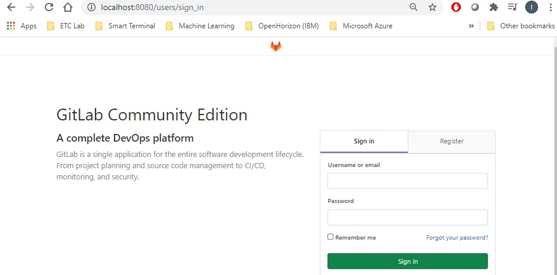
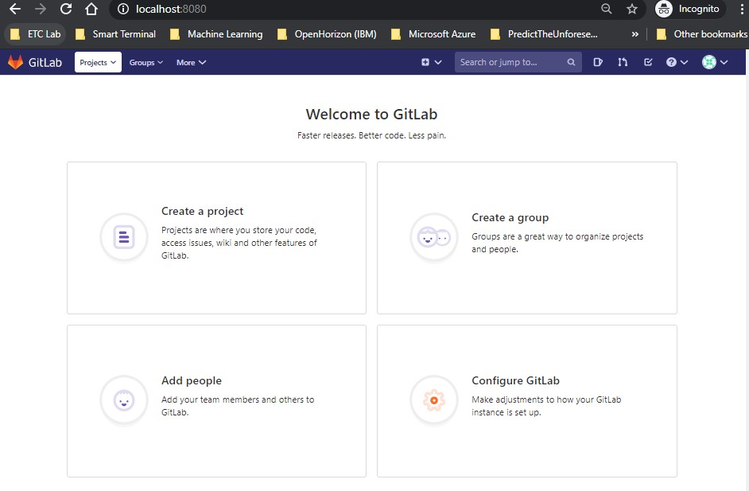
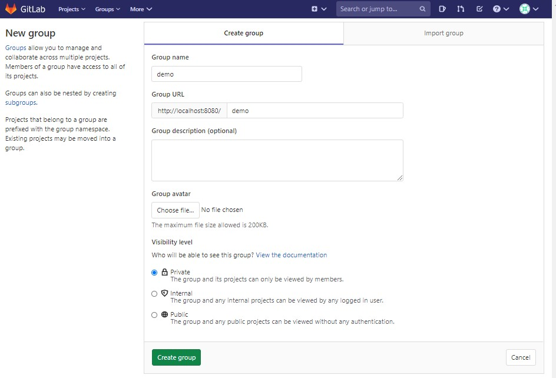
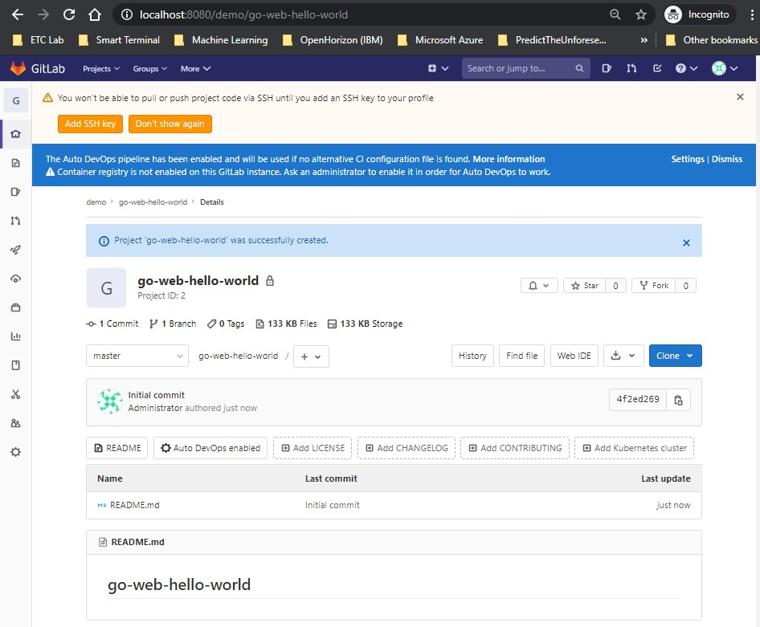
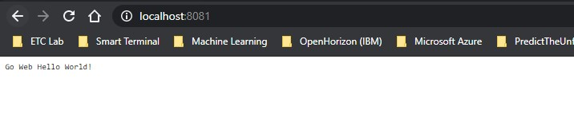
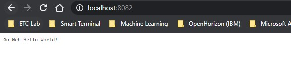

# Hello World SRE
## Install gitlab-ce Version in the Host
In order to install gitlab-ce, we need to follow the following steps: (Reference: https://about.gitlab.com/install/#ubuntu?version=ce)

1. Install and configure the necessary dependencies: `sudo apt-get install -y curl openssh-server ca-certificates tzdata`

2. Install Postfix to send notification emails (This is optional for our assignment as we do not need it): `sudo apt-get install -y postfix`

3. Add the Gitlab repo to our server: `curl -sS https://packages.gitlab.com/install/repositories/gitlab/gitlab-ce/script.deb.sh | sudo bash`

4. Install the Package: `sudo EXTERNAL_URL="http://127.0.0.1:80" apt-get install gitlab-ce`

5. Browse to the configured URL and you will be asked to change the password: Enter the desired password

6. You should land on this page



7. After logging in, you should land on this page:



## Create demo group/project in gitlab

1. Create a group
	1. Click on “Create a group” button on the landing page
	2. Provide a name for the group; in our case input : “demo”
	3. Update the group url by postfixing it with “demo”
	4. Click on “create group”



2. Create a project
	1. Click on “New project”
	2. Provide a name for the project; in our case input : “go-web-hello-world”
	3. Check the “Initialize repository with a README” button to create a readme.md file
	4. Click on “Create project”



## Build the App and expose the service to 8081 port
1. Add the repo for Go in our Ubuntu server
`sudo add-apt-repository ppa:longsleep/golang-backports
 sudo apt update`

2. Install golang: `sudo apt install golang-go`

Now let’s clone the empty repo that we created in gitlab and then create the our hello function

**Note**: in order to clone, we can do it via ssh or via http. In this exercise I am using http. Also we are assuming that git is already installed on the Ubuntu server. If git is not installed, you can install it using the following command: sudo apt-get install git

1. Clone the repo by running the following on the Ubuntu server: `git clone http://127.0.0.1/demo/go-web-hello-world`
Enter the username and the password when prompted. Note you can skip this by configuring an ssh key and then you can do the clone without the need to enter a password.

2. Create the main function inside the cloned repo. Name the file “main.go”

3. Add the file you created to gitlab: `git add .`

4. Commit the changes: `git commit -m "PUT-YOUR-COMMENT-HERE"`

5. Push the changes: `git push`
Now we need to build/run the application. There are many ways to do so and we can create a pipeline in Gitlab and use a runner to build the app for example. But in this case, and just for simplicity, we are going to build/run the app locally on the ubuntu server. 

**First approach**: Build the application and then run the executable

1. `go build main.go`

2. `./main` 

3. Now our application is running in the background



**Second approach**: Directly run the application using the following command: `go run main.go`


## Install Docker-CE

Follow the following steps in order to install docker-ce on the Ubuntu server (Reference: https://docs.docker.com/engine/install/ubuntu/)
1. Uninstall any existing old version: `sudo apt-get remove docker docker-engine docker.io containerd runc`

2. Setup the repository: `sudo apt-get update`

3. Install the requirements

```
sudo apt-get install \
    apt-transport-https \
    ca-certificates \
    curl \
    gnupg-agent \
    software-properties-common
```

4. Add the docker GPGkey: `curl -fsSL https://download.docker.com/linux/ubuntu/gpg | sudo apt-key add –`

5. Verify the fingerprint: `sudo apt-key fingerprint 0EBFCD88`

6. Add the stable repository 
```
sudo add-apt-repository \
   "deb [arch=amd64] https://download.docker.com/linux/ubuntu \
   $(lsb_release -cs) \
   stable"
```

7. Install the docker engine: `sudo apt-get update && sudo apt-get install docker-ce docker-ce-cli containerd.io`

## Run the app in a container

There are many ways and many images available that we can use for creating our docker image that will run our app. For example, we can use the docker golang image, and we run the main.go from the dockerfile. The reason I didn’t chose this method is because the golang image is big (around 840 MB)

The approach I used is to use the executable that we created in previous section using the “go build” command.

The Dockerfile has the following simple contents
```
FROM ubuntu
ADD ./main /
RUN chmod +x /main
ENTRYPOINT cd / && ./main
```
1. In order to build the image, execute the following command: `docker build -t go-web-hello-world .`

2. In order to run the container, execute the following command: `docker run -d -p 8082:8081 --name hello-web go-web-hello-world`

3. Here is the result when we try to access the endpoint:



## Push the image to Dockerhub

1. First, we need to login to docker by using the following command: `docker login`

Enter the username and password for the docker id

2. Next, we need to tag our local image before we push it to the docker repo: `docker tag go-web-hello-world:latest idandancn/go-web-hello-world:v0.1` 

3. Now, we can push the docker image by using the following command: `docker push idandancn/go-web-hello-world:v0.1`

**Note**: In order to pull the image for later use, you can execute the following command: `docker pull idandancn/go-web-hello-world:v0.1`
 


