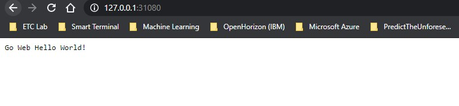
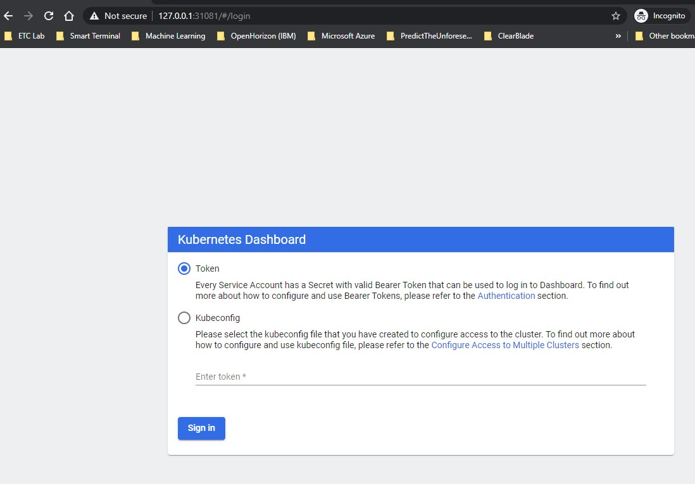
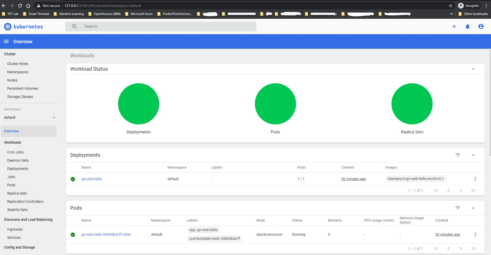

# Kubernetes for SRE

## Install a single node Kubernetes cluster using kubeadm

In this section we will be installing a kubernetes cluster using kubeadm. 

**Note**: run step 1 & 2 commands as root
1. First we have to install the kubernetes components
```
curl -s https://packages.cloud.google.com/apt/doc/apt-key.gpg |  apt-key add -
cat <<EOF >/etc/apt/sources.list.d/kubernetes.list
deb https://apt.kubernetes.io/ kubernetes-xenial main
EOF
```
`apt-get update`
`apt-get install -y kubelet kubeadm kubectl` 

2.Run kubeadm to setup the cluster using the following command: `kubeadm init --pod-network-cidr=10.244.0.0/16`

**Note 1**: pod-network-cidr is the pod network that our cluster will use

**Note 2**: make sure that the swap memory is disabled (sudo swapoff –a )

**Note 3**: Make sure that the docker daemon is using system if not already done. Refer to the following link for detailed steps: https://kubernetes.io/docs/setup/production-environment/container-runtimes/

3. Change back to your regular user and execute the following commands in order to be able to execute the kubectl commands later as the regular user:
```
mkdir -p $HOME/.kube
sudo cp -i /etc/kubernetes/admin.conf $HOME/.kube/config
sudo chown $(id -u):$(id -g) $HOME/.kube/config
```
4. Install flannel for pod networking (you can install different container network interfaces such as canal, calico, weave,etc..)

`kubectl apply -f https://raw.githubusercontent.com/coreos/flannel/master/Documentation/kube-flannel.yml`

5. Since we are having only a single node cluster, we need to taint the nodes in order to enable scheduling pods on the control plane node. We can accomplish that using the following command: 
`kubectl taint nodes --all node-role.kubernetes.io/master-`


## Deploy the hello world container

In this section, we are going to create a deployment and then expose it as a service to use the node port 31080. We are going to do all this in the “default” namespace

1. Create the deployment: `kubectl create -f go-web-deploy.yaml`

2. Create the service: `kubectl create -f go-web-service.yaml`

3. Now we can access the service by doing curl http://127.0.0.1:31080



## Install Kubernetes Dashboard

In this section, we are going to deploy the kubernetes dashboard
1. Deploy the Dashboard: `kubectl apply -f https://raw.githubusercontent.com/kubernetes/dashboard/v2.0.0/aio/deploy/recommended.yaml`

2. Edit the dashboard service to make it use nodeport instead of cluster ip: `kubectl -n kubernetes-dashboard edit service kubernetes-dashboard` 

Update the “**type**” to “**NodePort**” and set the :nodePort” to be “**31081**”. The yaml file is also uploaded to the github for reference

3. Access the dashboard by going to the following url: https://127.0.0.1:31081

 

## Generate token for dashboard login

In this section, we will show how to create and get the token in order to access the dashboard.
1. First, we need to create a service account: `kubectl create -f service-account.yaml`

2. Next, create the cluster role binding: `kubectl create -f cluster-role-binding.yaml`

3. Then we need to get the token that we will input on the GUI to be able to log in
`kubectl -n kubernetes-dashboard describe secret $(kubectl -n kubernetes-dashboard get secret | grep admin-user | awk '{print $1}')`

4. Now navigate to the dashboard gui on https://127.0.0.1:31081 and paste the token. Now you should be logged in


